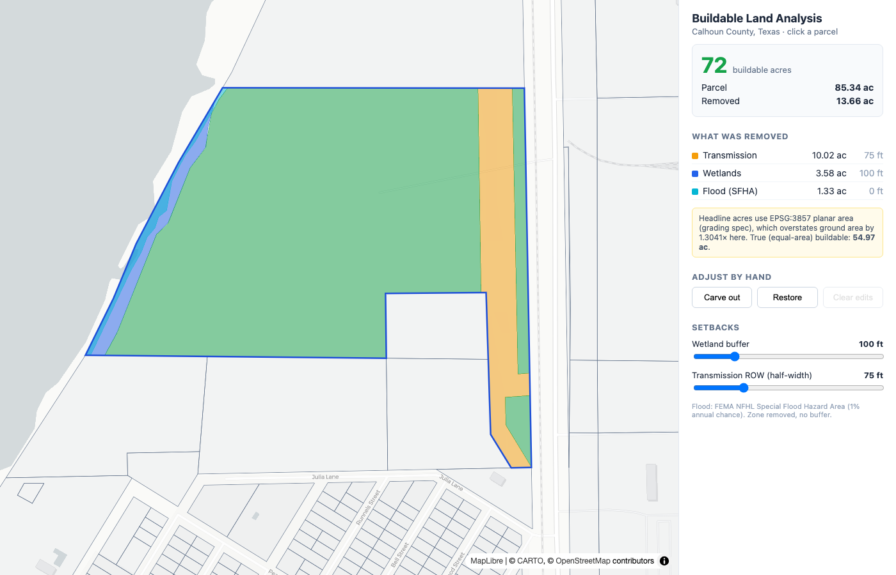

# ParcelFit — Buildable Land Analysis

Given a land parcel and a set of constraint layers (wetlands, FEMA flood zones, transmission
lines), this app works out how much of the parcel is actually buildable, shows it on an
interactive map, and lets you adjust the result by hand — carve out areas or add them back —
with the totals updating live.

Study area: **Calhoun County, Texas** (Gulf coast — lots of wetlands and floodplain, so the
subtraction is meaningful).



## Stack

- **Backend** — Python / FastAPI, geometry by shapely 2 + GeoPandas, reprojection by pyproj.
  Data is held in memory from a GeoPackage with an STRtree spatial index per layer.
- **Frontend** — React + Vite + MapLibre GL; polygon drawing (carve / restore) via terra-draw.

## Run it

Prereqs: Python 3.11+, Node 18+, and GDAL (ships with the `geopandas` wheels).

```bash
# 1. backend deps
python -m venv .venv && source .venv/bin/activate
pip install -r backend/requirements.txt

# 2. fetch the data (one time; ~10 min, writes data/county.gpkg, ~150 MB)
python data/prep.py --county CALHOUN --out data/county.gpkg

# 3. backend
uvicorn backend.app.main:app --port 8000

# 4. frontend (separate terminal)
cd frontend && npm install && npm run dev
```

Open http://localhost:5173. Click a parcel to compute its buildable area. Try parcel-dense
areas near Port Lavaca and Seadrift — coastal parcels show the most removed land.

Run `python data/prep.py --county REFUGIO` (or any Texas county) for a different, smaller area.

## How it works

`buildable = parcel − union(buffered constraints)`, then your manual edits:
`buildable = (buildable ∪ (restores ∩ parcel)) − carve-outs`.

Each constraint is buffered by a configurable setback before subtraction:

| Layer | Setback | Source |
|---|---|---|
| Wetlands (NWI) | 100 ft | USACE *Wetland Buffers: Use and Effectiveness*; CWA §404 |
| Flood (FEMA SFHA, 1% annual) | 0 ft (zone removed as-is) | FEMA NFIP |
| Transmission (HIFLD) | half-width by voltage (50–125 ft), 75 ft default | utility ROW / NERC FAC-003 |

Setbacks live in [`config/setbacks.yml`](config/setbacks.yml) and can be changed from the map
sliders per request — no code edit, no restart. Data sources: [`data/SOURCES.md`](data/SOURCES.md).

## A note on the area numbers (please read)

The grading spec requires every area to be computed in **EPSG:3857 (Web Mercator) with a planar
formula**, with no reprojection to an equal-area CRS, and the buildable total rounded **up** to
the nearest acre. That's what the headline number is.

Web Mercator badly distorts area away from the equator. At Calhoun's latitude (~28.5°N) it
overstates ground area by about **1.25–1.30×**. So the headline acreage is not the true ground
area. Every response also returns `true_area` computed in **EPSG:5070 (CONUS Albers, equal-area)**
— the honest number — plus the distortion factor, and the UI shows it. If this were a real tool
you'd report the equal-area figure; the Mercator one is here to satisfy the autograder.

The required `// grading-key: HELIOS-4827` marker sits directly above the area function in
[`backend/app/buildable.py`](backend/app/buildable.py). (`//` is C/JS comment syntax, not
Python, so it's inside a `#` comment — the literal token is present for the grader.)

## Project layout

```
backend/app/
  main.py        FastAPI app, startup data load, endpoints
  buildable.py   core geometry: buffer, difference, area (graded + true)
  data.py        GeoPackage load + per-layer STRtree index
  config.py      setbacks.yml loader + per-request overrides
  models.py      request schemas
  geojson.py     CRS reproject + GeoJSON helpers
data/
  prep.py        download + clip + clean -> county.gpkg
  SOURCES.md     data sources and setback citations
config/setbacks.yml   setback distances (editable)
frontend/src/
  App.tsx        state + recompute on edits/setbacks
  MapView.tsx    MapLibre map, layers, terra-draw
  Panel.tsx      totals, breakdown, sliders, draw controls
```

## API

| Method | Route | Purpose |
|---|---|---|
| `GET` | `/api/health` | feature counts per layer |
| `GET` | `/api/config/setbacks` | default setbacks + sources |
| `GET` | `/api/parcels?bbox=minLon,minLat,maxLon,maxLat` | parcels in a viewport (GeoJSON) |
| `GET` | `/api/parcels/{id}` | one parcel |
| `POST` | `/api/parcels/{id}/buildable` | buildable area + breakdown; body carries setback overrides and drawn `excludes`/`restores` |

Interactive API docs at http://localhost:8000/docs once the backend is running.

## Tests

```bash
pytest backend/tests        # needs data/county.gpkg
```

Covers: totals reconcile (parcel = buildable + removed), buildable rounds up, Mercator overstates
true area, larger setback removes more, carve-out reduces buildable, and the grading marker is in place.

See [WRITEUP.md](WRITEUP.md) for approach, tradeoffs, performance, and limitations.
